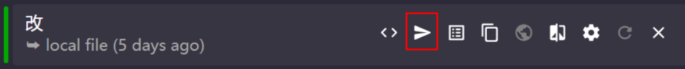
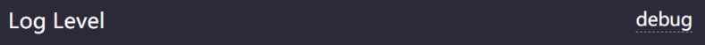

# Clash

> clash是一款科学上网工具，具有非常强大的节点管理、自定义代理规则等功能，开源免费，支持全平台（安卓，windows，mac，linux）出了iphone是人上人用的确实没办法。可以实现大批量节点的代理负载均衡，按照延迟自动选择路线等非常人性化的功能，甚至还有简单的广告屏蔽，适合购买了机场的同学。然后强大的第三层代理（tun、tap）可以实现游戏加速，内网网关代理，全家科学上网等骚操作，非常的amazing。

## windows（CFW）

cfw（clash for windows）目前版本不换clash内核的话不支持ssr节点（clashR支持，这里不讲，自己折腾）

* [CFW下载地址](https://cloud.caliburn.work:8888/s/TTiFwzTgZgBQHGs) 这个是本体，下载之后安装就好了

* 还需要一个配置文件，里面装了节点信息，节点分类，代理规则，等等

### 界面介绍Dashboard

打开软件之后就第一眼就是这个界面，这里讲下主要几个功能（重要的会**加粗**）

| 选项               | 中文         | 意义                                                         |
| ------------------ | ------------ | ------------------------------------------------------------ |
| port               | 端口         | **内网代理的端口号，其他电脑可以连接实现中转翻墙（如：switch）** |
| allow LAN          | 允许局域网   | **允许局域网内其他电脑连接**                                 |
| log level          | 日志级别     | 什么情况下记录日志，选择debug时日志会很详细                  |
| ipv6               | 是否启用ipv6 | 是否使用ipv6                                                 |
| core version       | 内核版本     | calsh的内核版本，前后台是分开的                              |
| UWP loopback       | UWP环回      | 一些微软的沙盒app需要这个（win8的那种类似手机的app）         |
| home directory     | home路径     | clash软件在哪                                                |
| TAP device         | TAP设备      | **这个是个三层代理，游戏加速的时会用**                       |
| service mode       | 服务模式     | 不太清楚，以服务模式运行？                                   |
| Mixin              | Mixin        | 貌似是配置文件编辑器，不过我都用vscode                       |
| system proxy       | 系统代理     | **开启或者关闭代理**                                         |
| start with windows | 开机启动     | 是否开机启动                                                 |

软件运行之后系统托盘会出现一个小猫咪，不启用代理时会是启用之后就会变成，右键点击🐱会出现下面的弹框

* 可以通过点击system Proxy方便的启用挥着关闭代理
* **可以通过proxy mode切换代理模式，常用的就是global全局模式（所有http请求都会通过代理完成，无论是国内网站还是国外网站统统走代理），还有就是rule规则模式（流量会按照一定的规则流动，比如访问国内网站就走直连，访问google就走代理，访问广告域名就timeout）**

### 添加配置文件

装了软件之后，你没有把你的节点信息和上网规则导入到clash中，肯定是无法实现科学上网的，最起码你得有一个可实现代理功能的节点，如果你购买了机场，因为节点数量比较多，都会给你一个订阅地址，切换到profile标签下面就可以看到当前的本地的配置文件了，**配置文件中包括了节点信息，和代理规则等重要的信息，一般情况下不要分享给其他人**

机场的话在输入订阅地址就点击右边的download下载按钮clash就会自动的帮你下载配置文件并且启用了，要是报错的话就需要对配置文件进行调整。

当然也可以用手动的方法添加配置文件,直接选中配置文件拖拽到窗口中就可以了

配置文件的话，在群里的话群友应该知道的，不会吧不会吧，不会没有看群消息把

### 配置文件的讲解

把目光放在配置文件的这个页面上

来稍微讲解一下把

| 截图                                                         | 意义                                                         |
| :----------------------------------------------------------- | ------------------------------------------------------------ |
| 前面那个绿灯                                                 | 谁是绿的就表示使用的谁，这个都看不懂我怀疑你不是人类         |
| 编辑配置文件 | 使用文本模式编辑配置文件，不懂得话看看就好，请不要编辑，里面一个符号对不上都会导致配置文件无法识别 |
| 编辑节点 | 可以按照自己的喜好添加和删除代理节点，比如新建一个“日本地区”的代理组，然后把所有日本的节点都归到那个组下，然后在某些特定的情况下（如访问一些只有日本本土才能访问的网站的时候）启用这种代理就可以访问了 |
| 编辑规则 | 编辑上网和代理规则，比如访问国内某些域名不使用代理，访问日本的域名使用日本的代理，访问hbo和奈飞时使用美国或者欧洲的代理，可以引入其他人写的规则，实现广告屏蔽等功能，非常实用 |
| 备份当前选择的文件 | 需要修改配置或者要尝试新规则时先手动备份一下，到时候玩拖了也好切换回原来的方案，不至于GG |
| 其他 | 这些功能诸如 自动更新订阅啊，修改配置文件名称啊之类的自己摸索就好，手动导入的配置文件是没有办法更新订阅的 |

### 代理界面Proxies

代理界面也比较重要，虽然在clash配置文件中我们配置了节点和对应的规则，电脑可以自动的分配流量，但是有些时候，网络环境发生了变化，以前的节点可能出现延迟过高等不好的状况，这个时候就需要到代理界面进行手工测速和节点选择了，自动挡拉跨了，开手动挡，界面如下

比如在当前配置文件中，**我将所有访问 广告 域名的流量 交给 Ads这个代理组**如下图，可以看到，Ads代理组里面有三个节点，分别是Emergency（自己搭建的很慢的一个节点）、REJECT（这个并不是真实存在的节点，只是为了拒绝连接请求添加的）、DIRECT（虚拟节点，直连）

现在REJECT是出于激活状态的，也就是说所有的访问广告域名的流量，都会发送给REJECT，也就是说clash直接把这个请求给拦截了，也就实现了广告屏蔽的功能，但是，有些网站你不看广告是不让你打开的，这时候，你就可以选择其他的代理方式给这种流量一个对应的处理方法就行了（比如选择Emergence这个很慢很慢的代理，广告加载就会很慢），是不是很好懂

不同的节点组也有不同的对应方案，例如这个叫HongKongTaiwan的这个代理组，显而易见通过小学阅读理解就可以知道这个代理组里面全是港港和湾湾的节点，然后后面有一个（LoadBalance）负载均衡，你会发现里面的节点都无法选择，这是因为**负载均衡**这个方法会利用所有的节点，把指向这个代理组的流量按照一定的算法均匀的分给每一个组员（一般是按照延迟大小，或者就是均匀分配雨露均沾）

在配置文件页面中，点击编辑节点里面可以发现，节点组有四种 组对节点的方案

* url-test ：ping下面的url网址，延迟越小优先选择，相同就随机
* fallback：不太常用
* select：使用者自行在proxies页面下选择，上文提到了
* load-balance：负载均衡

这里那个蓝色的500意思是：对于当前节点组中的节点，ping 那个URL，延迟超过500ms的就算做无法连接，一般来说如果对延迟没有要求的话，这个延迟尽量的开大一点。

### 日志

之后就是日志了，日志也是网络出现问题寻找解决问题的非常有效的工具，观察下面截图

因为我在主界面dashboard选择的日志模式是debug 所以日志信息会很详细

随便分析两条

这条访问id.google.com的数据走的是 PROXY 这个代理组中的  [V2白金57-广新|1倍流量|V2ray]  这个节点，请求成功，如果这条记录是红色的话就表示访问不成功

这一条百度的，使用的代理组就是DIRECT（直连），这个既是一个代理组，也是一个节点

之后发现有什么节点老是不走代理的话，看看日志是什么情况