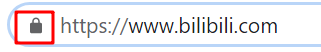
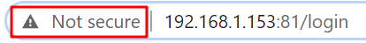
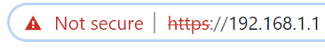
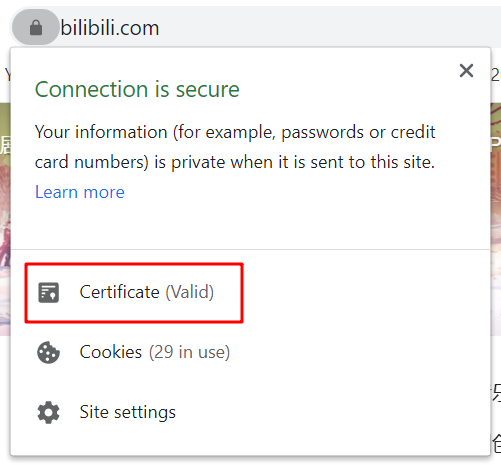
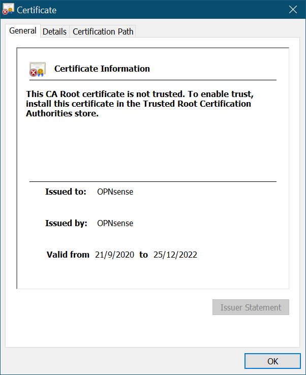
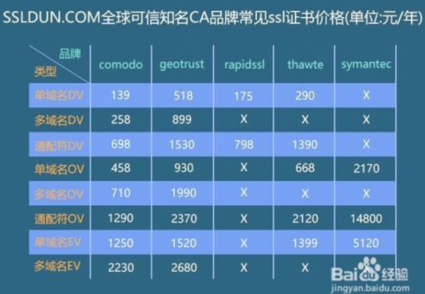

# 创建Dockers服务器群(LetsEncrypt反向代理篇)

> 先来说说Letsencrypt是什么吧，这就要从大家小学二年级就学过的http通信说起了，众所周知HTTP协议是 **明文** 通信，也就是说包括你在网页上输入的密码，在传递到服务器的时候，也是裸奔的，一旦有人截获了你输入密码的这个数据包的话，你的密码几乎就被瞬间破解了（虽然用了点手段，但是很容易被破解，肯定没有ssl或者tls使用的RSA *非对称加密* 来的安全），所以呢，还是推荐大家使用https通信的。letsencrypt服务能为你的网站提供免费https加密的同时，还支持多域名的反向代理，非常方便。

## 开始前的废话

先介绍介绍相关技术吧

* HTTPS加密技术是个啥
* 什么是反向代理

### HTTPS加密

如果你和笔者一样使用的是chrome浏览器的话，可以看到在输入网址的文本框旁边有一个🔒的图标，这表示着此网站使用了 **被承认的加密证书** ，并且展开URL我们可以看到前面表示协议的部分有https的字样

相反，没有使用加密技术的网站就会使这样，浏览器就会出现未加密的警告提示

其实还会有一种情况，就是网址使用了加密，但是加密证书 **不被承认**  所以浏览器会提示风险页面（比如自己用openssl生成的奇奇怪怪的证书，或者已经到期的ca证书，都会让浏览器产生这样的提示），这让拥有强迫症的我非常的不爽

要查看网络对应的证书在小🔒上点击查看证书即可

已经认证的证书我就不展示了，随便找一个带网站都可以看到，这些信息都可以在whois上查到就不多赘述了，这里只展示一下不受信任的证书是什么样子

这个是内网防火墙使用openssl给自己颁发的证书，当然是不受信任的，是不是很疑惑，为什么加密还有信任和不信任的，证书又是什么啊，和加密有什么关系呢？下面我就简单得抛几个“专业术语”，然后用自己的语言概括总结一下，有兴趣的同志可以去了解一下

* RSA非对称加密
* CA证书
* TLS和SSL

说白了，如果你要开一个干杂店，就需要有一张营业执照，同理网站要合法合规，要有有信用的人或者机构来给你作证，要颁发一个证书给你（国家给你营业执照，CA机构给你颁发CA证书），虽然为了恰饭（通信加密）你可以用一张自己画的（自己生成）的营业执照（CA证书），但是你的干杂店（网站）肯定不是正规的。

从上面的这个非常不恰当的例子中估计可以大致的理解证书的流程了，但是证书和加密的关系在这就不讲了，反正知道CA中含有加密的重要部件就行。

既然是找一个人给你作证，那么money肯定是少不了的，办证要钱啊，再说了CA机构在怎么拉跨也算是个保密相关的单位了，所以买一个正常的CA证书大致的价格是。。。

随便扣张图，好家伙，这价格怎么不去抢啊 !

但是，上有政策下有对策，营业执照价格抢人，👴就自己做一个，于是就诞生了openssl自制证书的方法，但是前面提到过自己使用的‘不正规’证书会在浏览器中出现安全警告

搞得我20年老强迫症复发，怎么办怎么办？这个时候，一个伟大的而又熟悉的身影站在了我的前面，他拍拍我的肩膀，递给我一个东西，然后转身匆匆离去，在他飞扬的披风上，我只看到三个大字 **白嫖党** 。等我回过神来，看了看手上他递给我的东西，这个东西其实就是今天的主角

**LetsEncrypt  :  一款提供免费合法证书的反向代理软件**

抓重点 **合法CA、反向代理** 最重要的是 **免费**

可能有人会问，那这样CA还有什么意义吗，黑客不是也可以使用这个来让自己的钓鱼网站看上去更像那么回事吗，对于这种杠精，我特么只能说，说那么多干什么，上不上车，白嫖都不香吗，再不上车我关门了！

### 反向代理

反向代理听上去很高端很大气，实质上确实也高端大气，只不过这里用到的东西理解一下原理就好。

* 什么是代理

* 什么是反向代理

* 反向代理可以用来干什么

* 

* 

* 

* 

* 

  