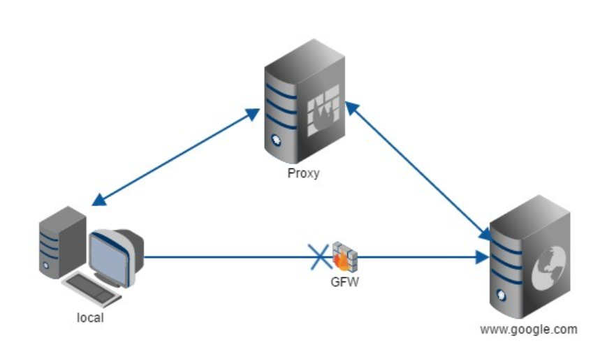
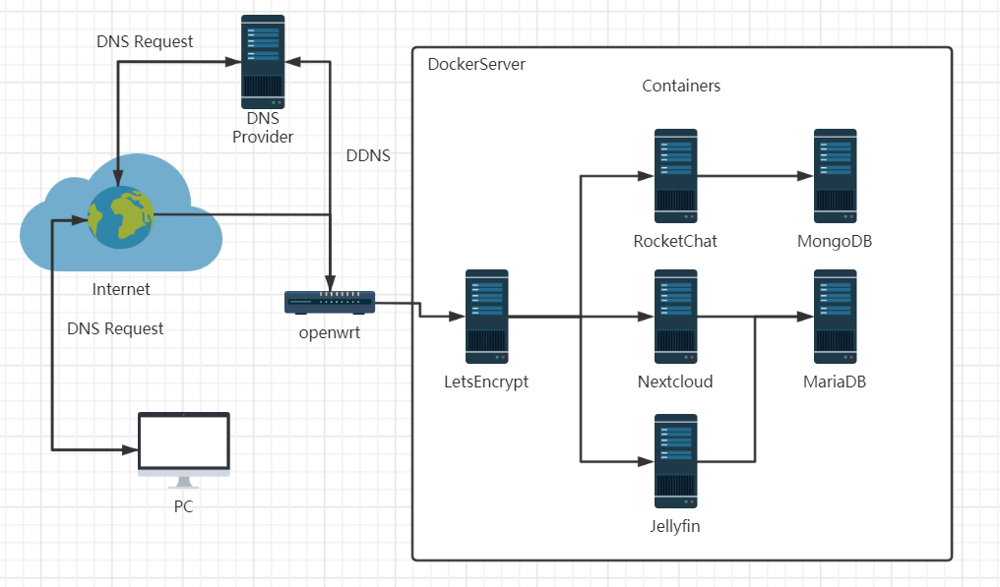

# 创建Dockers服务器群(LetsEncrypt反向代理篇)

> 先来说说Letsencrypt是什么吧，这就要从大家小学二年级就学过的http通信说起了，众所周知HTTP协议是 **明文** 通信，也就是说包括你在网页上输入的密码，在传递到服务器的时候，也是裸奔的，一旦有人截获了你输入密码的这个数据包的话，你的密码几乎就被瞬间破解了（虽然用了点手段，但是很容易被破解，肯定没有ssl或者tls使用的RSA *非对称加密* 来的安全），所以呢，还是推荐大家使用https通信的。letsencrypt服务能为你的网站提供免费https加密的同时，还支持多域名的反向代理，非常方便。

## 开始前的废话

先介绍介绍相关技术吧

* HTTPS加密技术是个啥
* 什么是反向代理

### HTTPS加密

如果你和笔者一样使用的是chrome浏览器的话，可以看到在输入网址的文本框旁边有一个🔒的图标，这表示着此网站使用了 **被承认的加密证书** ，并且展开URL我们可以看到前面表示协议的部分有https的字样


相反，没有使用加密技术的网站就会使这样，浏览器就会出现未加密的警告提示


其实还会有一种情况，就是网址使用了加密，但是加密证书 **不被承认**  所以浏览器会提示风险页面（比如自己用openssl生成的奇奇怪怪的证书，或者已经到期的ca证书，都会让浏览器产生这样的提示），这让拥有强迫症的我非常的不爽


要查看网络对应的证书在小🔒上点击查看证书即可


已经认证的证书我就不展示了，随便找一个带网站都可以看到，这些信息都可以在whois上查到就不多赘述了，这里只展示一下不受信任的证书是什么样子


这个是内网防火墙使用openssl给自己颁发的证书，当然是不受信任的，是不是很疑惑，为什么加密还有信任和不信任的，证书又是什么啊，和加密有什么关系呢？下面我就简单得抛几个“专业术语”，然后用自己的语言概括总结一下，有兴趣的同志可以去了解一下

* RSA非对称加密
* CA证书
* TLS和SSL

说白了，如果你要开一个干杂店，就需要有一张营业执照，同理网站要合法合规，要有有信用的人或者机构来给你作证，要颁发一个证书给你（国家给你营业执照，CA机构给你颁发CA证书），虽然为了恰饭（通信加密）你可以用一张自己画的（自己生成）的营业执照（CA证书），但是你的干杂店（网站）肯定不是正规的。

从上面的这个非常不恰当的例子中估计可以大致的理解证书的流程了，但是证书和加密的关系在这就不讲了，反正知道CA中含有加密的重要部件就行。

既然是找一个人给你作证，那么money肯定是少不了的，办证要钱啊，再说了CA机构在怎么拉跨也算是个保密相关的单位了，所以买一个正常的CA证书大致的价格是。。。


随便扣张图，好家伙，这价格怎么不去抢啊 !

但是，上有政策下有对策，营业执照价格抢人，👴就自己做一个，于是就诞生了openssl自制证书的方法，但是前面提到过自己使用的‘不正规’证书会在浏览器中出现安全警告


搞得我20年老强迫症复发，怎么办怎么办？这个时候，一个伟大的而又熟悉的身影站在了我的前面，他拍拍我的肩膀，递给我一个东西，然后转身匆匆离去，在他飞扬的披风上，我只看到三个大字 **白嫖党** 。等我回过神来，看了看手上他递给我的东西，这个东西其实就是今天的主角

**LetsEncrypt  :  一款提供免费合法证书的反向代理软件**

抓重点 **合法CA、反向代理** 最重要的是 **免费**

可能有人会问，那这样CA还有什么意义吗，黑客不是也可以使用这个来让自己的钓鱼网站看上去更像那么回事吗，对于这种杠精，我特么只能说，说那么多干什么，上不上车，白嫖都不香吗，再不上车我关门了！

### 反向代理

反向代理听上去很高端很大气，实质上确实也高端大气，只不过这里用到的东西理解一下原理就好。随便去知乎嫖一个解释的答案都能比我自己写的贵话好懂。

* 什么是正向代理

  我们常说的代理也就是只正向代理，正向代理的过程，它 **隐藏了真实的请求客户端** ，服务端不知道真实的客户端是谁，客户端请求的服务都被代理服务器代替来请求，某些科学上网工具扮演的就是典型的正向代理角色。用浏览器访问 http://www.google.com 时，被残忍的block，于是你可以在国外搭建一台代理服务器，让代理帮我去请求google.com，代理把请求返回的相应结构再返回给我。

  

* 什么是反向代理

  反向代理隐藏了真实的服务端，当我们请求 www.baidu.com 的时候，就像拨打10086一样，背后可能有成千上万台服务器为我们服务，但具体是哪一台，你不知道，也不需要知道，你只需要知道反向代理服务器是谁就好了，www.baidu.com 就是我们的反向代理服务器，反向代理服务器会帮我们把请求转发到真实的服务器那里去。Nginx就是性能非常好的反向代理服务器，用来做负载均衡。

  

  

* 这里的反向代理有什么用

  我们在家里用Letsencrypt使用的反向代理，不是为了负载均衡或者是隐藏服务端，只是为了我们的子域名能被正常的使用，比如我们已经购买了一个域名 helloworld.com，并且有多个子域名（如chat.helloworld.com等），然后家里的网络是这样的

  

  openwrt上有DDNS，我们把子域名全部指向路由器，然后再再路由器上配置转发规则将访问域名的数据指向内网docker服务器，然后再docker内网中由letsencrypt全权接管并且根据子域名转发给相应的服务器，比如chat.helloworld.com 的数据全部由Rocketchat服务接收，cloud.helloworld.com的数据全部由Nextcloud服务接收，而且letsencrypt服务还可以帮我们启用https加密，并且自动续期证书（一般来说这种临时的证书有效期都很短，一般是3个月），这样就很安逸了。

  > * Tips
  >
  >   这里还有一个域名提供商的坑，有些服务商只能提供DDNS服务，不能提供letsencrypt的验证 （笔者使用的ory花生壳就是不可以的，如果是家用DDNS获取公网ip的话，不开通80端口是无法完成验证的），这个时候就需要换到其他提供商例如阿里云去解析了。

## Let‘s Encrypt Installation

虽然不是同一时间，但是却是同一个 ~~撤硕~~ docker，我还是那句话，奥里给！上代码！

```shell
docker run 
  -itd     					#
  --cap-add=NET_ADMIN       #
  --name=letsencrypt        #
  --net='OscarsNet'         #网络名称
  -v /home/docker/letsencrypt/appconfig/:/config:rw
  							#映射配置文件夹
  -e PGID=1000 
  -e PUID=1000 
  -e EMAIL=oscar@qq.com     #颁发ca是需要的email
  -e URL=baidu.cmo          #你的顶级域名
  -e SUBDOMAINS=chat,qq,baidu  #子域名
  -e ONLY_SUBDOMAINS=true   #只为子域名申请ssl证书
  -e DHLEVEL=2048           #保持不变即
  -e VALIDATION=dns 		#使用dns验证（保持不变即可）
  -e DNSPLUGIN=aliyun 		#dns验证插件（保持不变即可）
  -p '8088:80/tcp'         
  -p '2443:443/tcp'         #端口映射
  -e TZ=Asia/Shanghai       #地域选择
  linuxserver/letsencrypt
```

  ```shell
docker run \
  -itd \
  --cap-add=NET_ADMIN \
  --name=letsencrypt \
  --net='bravenet' \
  -v /opt/docker/appdata/letsencrypt/:/config:rw \
  -e PGID=1000 \
  -e PUID=1000 \
  -e EMAIL=braveru@balabala.com \
  -e URL=braveru.space \
  -e SUBDOMAINS=chat,qq,baidu \
  -e ONLY_SUBDOMAINS=true \
  -e DHLEVEL=2048 \
  -e VALIDATION=dns \
  -e DNSPLUGIN=aliyun \
  -p '8088:80/tcp'  \
  -p '2443:443/tcp'  \
  -e TZ=Asia/Shanghai \
  linuxserver/letsencrypt
  ```

