# 创建Dockers服务器群(LetsEncrypt反向代理篇)

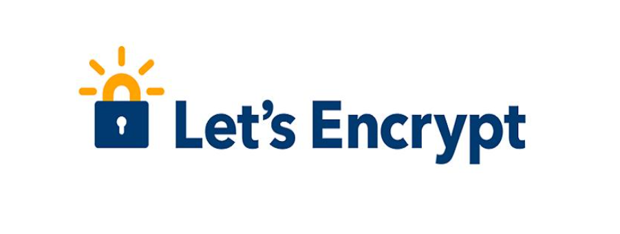

> 先来说说Letsencrypt是什么吧，这就要从大家小学二年级就学过的http通信说起了，众所周知HTTP协议是 **明文** 通信，也就是说包括你在网页上输入的密码，在传递到服务器的时候，也是裸奔的，一旦有人截获了你输入密码的这个数据包的话，你的密码几乎就被瞬间破解了（虽然用了点手段，但是很容易被破解，肯定没有ssl或者tls使用的RSA *非对称加密* 来的安全），所以呢，还是推荐大家使用https通信的。letsencrypt服务能为你的网站提供免费https加密的同时，还支持多域名的反向代理，非常方便。

## 开始前的废话

先介绍介绍相关技术吧

* HTTPS加密技术是个啥
* 什么是反向代理

### HTTPS加密

如果你和笔者一样使用的是chrome浏览器的话，可以看到在输入网址的文本框旁边有一个🔒的图标，这表示着此网站使用了 **被承认的加密证书** ，并且展开URL我们可以看到前面表示协议的部分有https的字样


相反，没有使用加密技术的网站就会使这样，浏览器就会出现未加密的警告提示


其实还会有一种情况，就是网址使用了加密，但是加密证书 **不被承认**  所以浏览器会提示风险页面（比如自己用openssl生成的奇奇怪怪的证书，或者已经到期的ca证书，都会让浏览器产生这样的提示），这让拥有强迫症的我非常的不爽


要查看网络对应的证书在小🔒上点击查看证书即可


已经认证的证书我就不展示了，随便找一个带网站都可以看到，这些信息都可以在whois上查到就不多赘述了，这里只展示一下不受信任的证书是什么样子


这个是内网防火墙使用openssl给自己颁发的证书，当然是不受信任的，是不是很疑惑，为什么加密还有信任和不信任的，证书又是什么啊，和加密有什么关系呢？下面我就简单得抛几个“专业术语”，然后用自己的语言概括总结一下，有兴趣的同志可以去了解一下

* RSA非对称加密
* CA证书
* TLS和SSL

说白了，如果你要开一个干杂店，就需要有一张营业执照，同理网站要合法合规，要有有信用的人或者机构来给你作证，要颁发一个证书给你（国家给你营业执照，CA机构给你颁发CA证书），虽然为了恰饭（通信加密）你可以用一张自己画的（自己生成）的营业执照（CA证书），但是你的干杂店（网站）肯定不是正规的。

从上面的这个非常不恰当的例子中估计可以大致的理解证书的流程了，但是证书和加密的关系在这就不讲了，反正知道CA中含有加密的重要部件就行。

既然是找一个人给你作证，那么money肯定是少不了的，办证要钱啊，再说了CA机构在怎么拉跨也算是个保密相关的单位了，所以买一个正常的CA证书大致的价格是。。。


随便扣张图，好家伙，这价格怎么不去抢啊 !

但是，上有政策下有对策，营业执照价格抢人，👴就自己做一个，于是就诞生了openssl自制证书的方法，但是前面提到过自己使用的‘不正规’证书会在浏览器中出现安全警告


搞得我20年老强迫症复发，怎么办怎么办？这个时候，一个伟大的而又熟悉的身影站在了我的前面，他拍拍我的肩膀，递给我一个东西，然后转身匆匆离去，在他飞扬的披风上，我只看到三个大字 **白嫖党** 。等我回过神来，看了看手上他递给我的东西，这个东西其实就是今天的主角

**LetsEncrypt  :  一款提供免费合法证书的反向代理软件**

抓重点 **合法CA、反向代理** 最重要的是 **免费**

可能有人会问，那这样CA还有什么意义吗，黑客不是也可以使用这个来让自己的钓鱼网站看上去更像那么回事吗，对于这种杠精，我特么只能说，说那么多干什么，上不上车，白嫖都不香吗，再不上车我关门了！

### 反向代理

反向代理听上去很高端很大气，实质上确实也高端大气，只不过这里用到的东西理解一下原理就好。随便去知乎嫖一个解释的答案都能比我自己写的贵话好懂。

* 什么是正向代理

  我们常说的代理也就是只正向代理，正向代理的过程，它 **隐藏了真实的请求客户端** ，服务端不知道真实的客户端是谁，客户端请求的服务都被代理服务器代替来请求，某些科学上网工具扮演的就是典型的正向代理角色。用浏览器访问 http://www.google.com 时，被残忍的block，于是你可以在国外搭建一台代理服务器，让代理帮我去请求google.com，代理把请求返回的相应结构再返回给我。

  

* 什么是反向代理

  反向代理隐藏了真实的服务端，当我们请求 www.baidu.com 的时候，就像拨打10086一样，背后可能有成千上万台服务器为我们服务，但具体是哪一台，你不知道，也不需要知道，你只需要知道反向代理服务器是谁就好了，www.baidu.com 就是我们的反向代理服务器，反向代理服务器会帮我们把请求转发到真实的服务器那里去。Nginx就是性能非常好的反向代理服务器，用来做负载均衡。

  

  

* 这里的反向代理有什么用

  我们在家里用Letsencrypt使用的反向代理，不是为了负载均衡或者是隐藏服务端，只是为了我们的子域名能被正常的使用，比如我们已经购买了一个域名 helloworld.com，并且有多个子域名（如chat.helloworld.com等），然后家里的网络是这样的

  

  openwrt上有DDNS，我们把子域名全部指向路由器，然后再再路由器上配置转发规则将访问域名的数据指向内网docker服务器，然后再docker内网中由letsencrypt全权接管并且根据子域名转发给相应的服务器，比如chat.helloworld.com 的数据全部由Rocketchat服务接收，cloud.helloworld.com的数据全部由Nextcloud服务接收，而且letsencrypt服务还可以帮我们启用https加密，并且自动续期证书（一般来说这种临时的证书有效期都很短，一般是3个月），这样就很安逸了。

  > * Tips
  >
  >   这里还有一个域名提供商的坑，有些服务商只能提供DDNS服务，不能提供letsencrypt的验证 （笔者使用的ory花生壳就是不可以的，如果是家用DDNS获取公网ip的话，不开通80端口是无法完成验证的），这个时候就需要换到其他提供商例如阿里云去解析了。

## Let‘s Encrypt Installation

安装很简单，配置难上天，docker的话安装也很方便，就是会花一些篇幅来讲讲nginx的反向代理配置

### 软件安装

虽然不是同一时间，但是却是同一个 ~~撤硕~~ docker，我还是那句话，奥里给！上代码！

```shell
docker run 
  -itd     					#
  --cap-add=NET_ADMIN       #
  --name=letsencrypt        #
  --net='OscarsNet'         #网络名称
  -v /home/docker/letsencrypt/appconfig/:/config:rw
  							#映射配置文件夹
  -e PGID=1000 
  -e PUID=1000 
  -e EMAIL=oscar@qq.com     #颁发ca是需要的email
  -e URL=baidu.cmo          #你的顶级域名
  -e SUBDOMAINS=chat,qq,baidu  #子域名
  -e ONLY_SUBDOMAINS=true   #只为子域名申请ssl证书
  -e DHLEVEL=2048           #保持不变即
  -e VALIDATION=dns 		#使用dns验证（保持不变即可）
  -e DNSPLUGIN=aliyun 		#dns验证插件（保持不变即可）
  -p '8088:80/tcp'         
  -p '2443:443/tcp'         #端口映射
  -e TZ=Asia/Shanghai       #地域选择
  linuxserver/letsencrypt
```

  ```shell
#脚本复制区域
#需要根据自己的情况不同而改动
docker run -itd --cap-add=NET_ADMIN --name=letsencrypt --net='OscarsNet' -v /opt/docker/appdata/letsencrypt/:/config:rw -e PGID=1000 -e PUID=1000 -e EMAIL=braveru@balabala.com -e URL=braveru.space -e SUBDOMAINS=chat,qq,baidu -e ONLY_SUBDOMAINS=true -e DHLEVEL=2048 -e VALIDATION=dns -e DNSPLUGIN=aliyun -p '8088:80/tcp' -p '2443:443/tcp'  -e TZ=Asia/Shanghai linuxserver/letsencrypt
  ```

等到镜像拉取安装完成之后然后就需要进去改一下配置

### 修改配置文件

如果只是配置一个代理，则需要修改两个文件

1. 通过aliyunAPI来绕开letencrypt的80或443的验证
2. 配置Nginx反向代理

#### 配置aliyun API

首先来讲一下什么是aliyunAPI，以及为什么需要用aliyun的accesskey来进行验证

* 什么是 aliyunAPI

  很简单，其实就是一个应用程序接口，就像一个shell，我们 **登录之后** 只要向里面发送一定的数据（可能是json打包的指令），阿里云收到我们的“指令”，然后就会进行相应的操作。一般很多网站都有自己的api，随便举个栗子，比如耳熟能详的飞机场vultr，要是你调用过百度地图等相关组件也会有一个api key，google也有，甚至就连一些电影网站都有（openmoviedb）自己的API，好了，说了那么多，哪里可以拿到阿里云的API登录密码呢（AccessKey）？

  在阿里云的管理界面，把鼠标悬停在头像上就会弹出一个菜单，选择下面的AccessKey管理创建AccessKey即可，创建之后可以随时查看，只要不重新手动生成就不会变化，当然注册时需要绑定手机号（阿里云账号可以通过支付宝等账号绑定管理）

  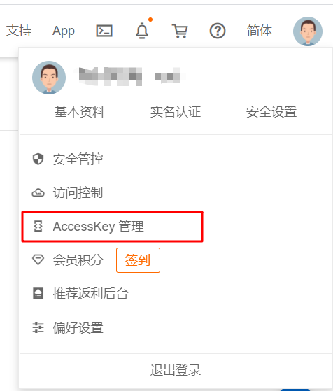

  

* AccessKey可以干什么

  通过AccessKey，对于普通用户来说，可以做的有如DDNS绑定，还有问们今天要用到的letsencrypt的验证，然后。如果你是开发者，那用到的地方可能会更多，具体原理笔者也没有继续研究，想着能用就万事大吉了。。所以还是劝你们 耗子尾汁 ，还是要有一定的钻研精神

* 简单讲一下letsencrypt的验证过程把

  本来letsencrypt给你颁发证书需要，你的域名有80端口和443端口，所以如果服务器使用的是家庭网络的话，ISP是封了这两个端口的，所以会导致验证不成功。那么就使用第二种方法发：在域名上添加一个TXT记录（为了确认这个域名就是你的）然后根据TXT记录确认域名是否是你的，有没有发现以上方法很麻烦，特别是后面涉及到自动续期等问题（这种免费的CA证书失效时间很快一般就在3个月，所以需要自动续期），这种东西要是装在实体机上那肯定是要折磨死人的，这时候像我一样懒的人就做了一个docker，里面可以自动帮咱续期，还有反向代理，功能齐全，


下面就来配置下

1. 首先打开MobaXtream或者其他带sftp的终端软件（传文件比较方便）
2. 进入docker映射出来的配置文件夹，比如笔者映射的配置文件目录就是 **/home/docker/letsencry/** 
3. 找到dns-conf下面的ailyun.ini文件，并打开
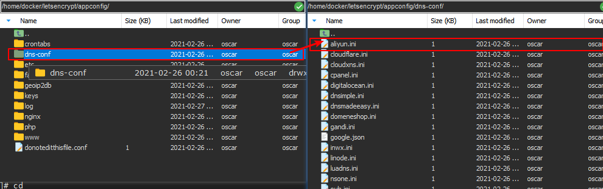
4. 之后把你的accesskey和密码填写在相应的额位置就好
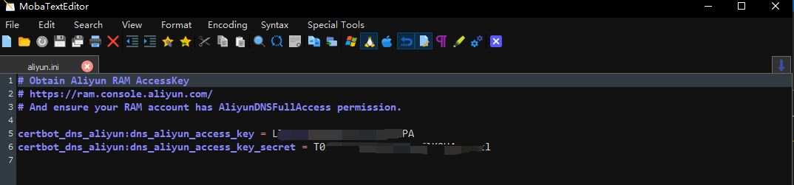
5. 保存退出，重启容器

```shell
docker restart letsencrypt=
```

6. 访问letencry的2443（容器内是443）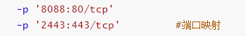我们上面做了端口映射,所以直接在浏览器中访问 docker宿主机的IP:映射端口  就可以了，如果得到如下结果就说明访问成功了（图片上的映射端口是8888）

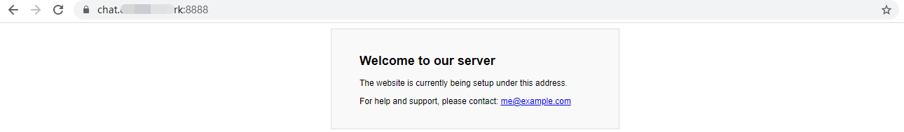


可以看到域名的左边出现了一把小锁，说明我们的访问已经被letsencrypt加密了

#### 配置Nginx 反向代理

上一步我们已经打通了互联网到letsencrypt的通道并为其经行了加密，之后我们需要大同letsencrypt到我们不同容器的通道，这样我们的服务才能够正常使用，这个章节会涉及Nginx的配置文件（别怕，笔者一开始也被大段大段的注释吓到过），所以会稍微有一点难度

上面也清楚的讲了反向代理相关的概念了，Nginx就是可以用来实现反向代理的软件（Nginx小巧但功能非常强大，有兴趣可以研究一下），它被集成在了letsencrypt这个容器之内，而且默认是会自动启动的，我们只需要对其配置文件进行一点配置就可以实现数据的转发了，话不多说，下面就直接开始吧

1. 打开远程终端软件，进入相应的配置文件夹 **/home/docker/letsencrypt/appconfig/** 

2. 进入nginx文件夹，继续进入 **proxy-confs** 文件夹进行代理设置

   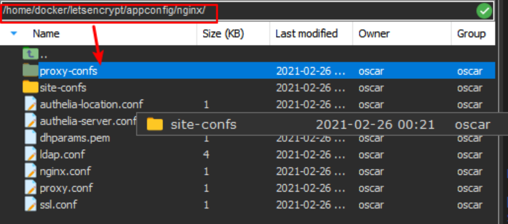

3. 看到里面有很多文件，不要怕他们得后缀名是.conf.sample，而能够读取是配置文件的后缀名是.conf，他们只是一个配置示例而已，打开按要求修改之后就可以被nginx读取啦

   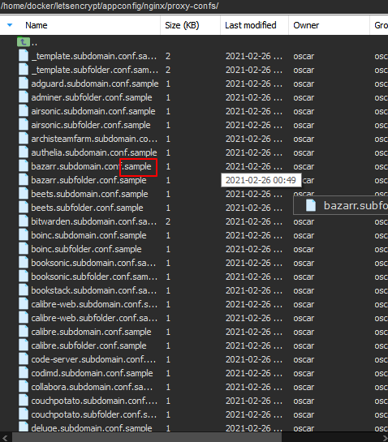

4. 找到（没有的话可以新建）需要配置的服务的配置文件，点击打开（没有就去网上找一找、搜一下，自学也很快的），在这里以nextcloud文件为例，先复制一下留个备份，然后再改掉原文件的文件名（改为conf），然后打开编辑器

   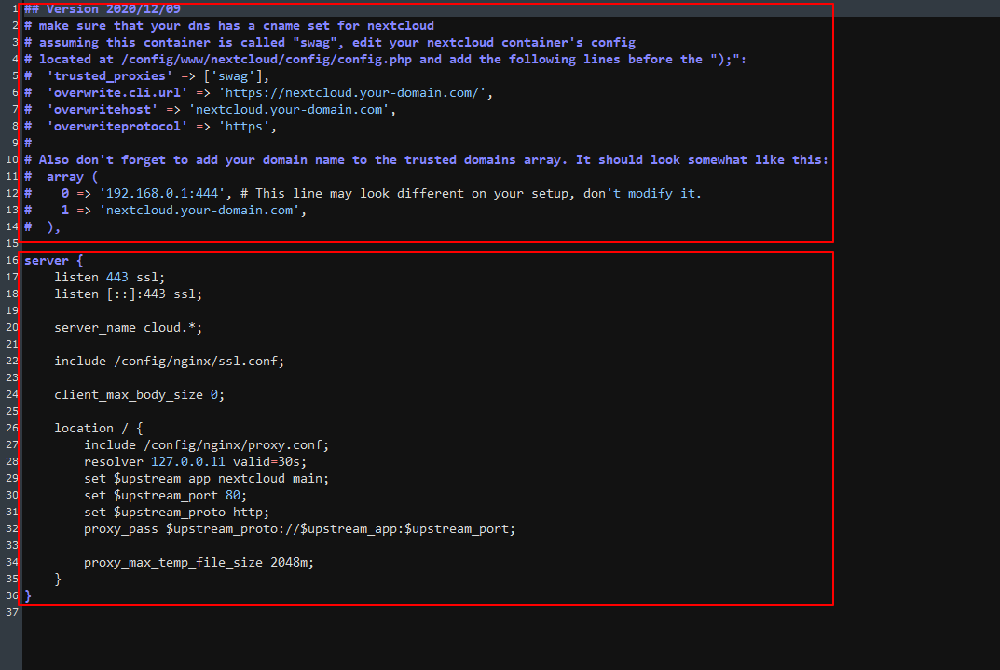

   可以看到，上面部分是一些注释（很重要，配置完成之后一定要按照上面的提示去修改nextcloud文件的配置）

   ​				    下面部分才是配置

   ```shell
   #  nginx http部分的虚拟server 配置块 、
   #  一个物理机上装的nginx可以为多个软件提供http协议的服务，所以这里server是指虚拟主机
   server {
       listen 443 ssl;						
       listen [::]:443 ssl;				#监听端口（这个是对于letsencrypt容器来讲的，我们已经映射出去了）
   
       server_name cloud.*;                #服务器名称 cloud.* ：端口号443(访问域名为cloud.xxxxx)的流量都会被这个 虚拟服务器 所处理            
       include /config/nginx/ssl.conf;     #ssl配置文件的引用，感兴趣可以去看看这个文件指向的是什么
   
       client_max_body_size 0;             #设置用户http上传的文件的最大大小 0表示无限制，也可以根据实际情况限制
   
       location / {							#访问位置为 域名/ 的流量都会
           include /config/nginx/proxy.conf;   #引用porxy配置文件
           resolver 127.0.0.11 valid=30s;      #和dns解析有关系，保持不表就好
           set $upstream_app nextcloud_main;    #变量声明 这里把nextcloud_mian 换成你的contianer名字就好
           set $upstream_port 80;				 # 这里填写 可以访问到你nextcloud容器的端口号（这里内网就可以访问）
           set $upstream_proto http;            #访问nextcloud时所使用的协议
           proxy_pass $upstream_proto://$upstream_app:$upstream_port; #这里就是变量的拼接，这个地址一定要能访问nextcloud
   
           proxy_max_temp_file_size 2048m;
       }
   }
   ```

   ##### TIPS！

   这里可能刚开始配置的时候location这里会比较懵逼，你需要站在反向代理的位置上去思考问题

   * 反向代理只关系数据的转发
   * 我们只要打通反向代理和提供服务（nextcloud）的电脑之间的通道就行
   * 站在nginx的角度上，要去访问nextcloud的提供者

   其实也就是说 `proxy_pass $upstream_proto://$upstream_app:$upstream_port;` 把变量填进去之后

   变成 `http://nextcloud_main:80` 这个URL要指向你的 nextcloud 服务提供者，并且保持联通！

   所以 location这里要站在反向代理的角度去配置这些变量

   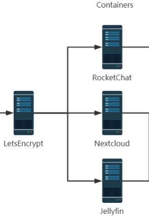

   你当然也可以通过进入container内部实验一下

   ```shell
   [root@localhost test]# docker exec -it letsencrypt bash   #进入容器内
   
   root@ac7273c8a313:/# curl http://nextcloud_main:80        #curl访问地址，没有报错就正常
   root@ac7273c8a313:/# ping nextcloud_main				  #ping  测试一下
   PING nextcloud_main (172.172.0.3): 56 data bytes
   64 bytes from 172.172.0.3: seq=0 ttl=64 time=0.191 ms
   64 bytes from 172.172.0.3: seq=1 ttl=64 time=0.174 ms
   ^C
   --- nextcloud_main ping statistics ---
   2 packets transmitted, 2 packets received, 0% packet loss
   round-trip min/avg/max = 0.174/0.182/0.191 ms
   
   ```

   然后重启容器配置就完成了

   ```shell
   docker restart letsencrypt
   ```

   这一步可能会出现很多问题，反复阅读上面的讲解，或者是去网上查阅相关的资料，只有真正理解了每一个配置的意义才会正真明白应该如何去写，光照着抄是肯定不行的，实践出真知！

### 安装完成

至此，配置letsencrypt就完成了

通过外网的域名加端口号再加子域名就可以访问nextcloud服务了，还不快去试试

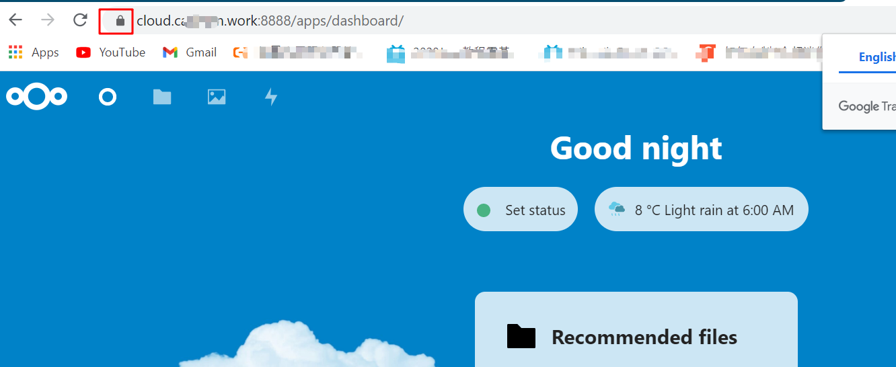

可以看到网址左边的小锁，表示我们的通信是加密的，配置成功

### 思考题

如果你能明白下面的问题的话，你就算是大致明白了这套系统的作用流程了

* 在nextcloud的设置下有一个自我检测，他会自动检测问题（安全隐患、性能问题等等）然后反馈给管理员，我们在这个界面下会看到如下的提示信息

  > Your web site is not using HTTPS for security!Please use .......

  大概意思就是检测到你的网站没有使用https加密，请使用https加密之后再。。。

  但是我们已经是https加密了的啊？为什么会出现这个提示信息呢？软件出BUG了吗？