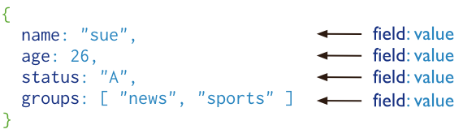

# RocketChat安装与配置


> RocketChat是一款开源免费的聊天服务软件，就是自己做的微信，有服务器就行，聊天数据都保存在自己的服务器上，不用成为xx公司的大数据的一部分了，然后某种程度上可以以脱离相关部门的监管，群里的车速也可以快一点了。话不多说，直接安装

rocketchat依赖于mongodb这个数据库，所以安装rocketchat之前，必须安装上mongodb

### MongoDB的安装


> MongoDB 是由C++语言编写的，是一个基于分布式文件存储的开源数据库系统。
>
> MongoDB 将数据存储为一个文档，数据结构由键值(key=>value)对组成。MongoDB 文档类似于 JSON 对象。字段值可以包含其他文档，数组及文档数组。
>
> 

### 安装MongoDB

安装之前需要在相应位置下面建立配置文件

```shell
# mongod.conf

# for documentation of all options, see:
#   http://docs.mongodb.org/manual/reference/configuration-options/

# Where and how to store data.
storage:
  dbPath: /data/db
  journal:
    enabled: true
#  engine:
#  mmapv1:
#  wiredTiger:

# network interfaces
net:
  port: 27017
  bindIp: 127.0.0.1

# how the process runs
processManagement:
  timeZoneInfo: /usr/share/zoneinfo

#security:
#  authorization: "enabled"

#operationProfiling:

replication:
  replSetName: "rs01"

#sharding:

## Enterprise-Only Options:

#auditLog:

#snmp:

```


```shell
docker run 
-itd 											#交互模式运行
--name='mongo'  								#容器名
--net='OscarsNet' 								#连接到网络
-e TZ="Asia/Shanghai" 							#时区
-p '27017:27017' 								#端口
-v '/home/docker/mongodb/appdata':'/data/db'    #数据地址
-f /data/db/mongod.conf							#配置文件
```

```shell
#复制区
docker run -itd --name='mongo' --net='OscarsNet' -e TZ="Asia/Shanghai" -p '27017:27017' -v '/home/docker/mongodb/appdata':'/data/db' -f /data/db/mongod.conf
```

