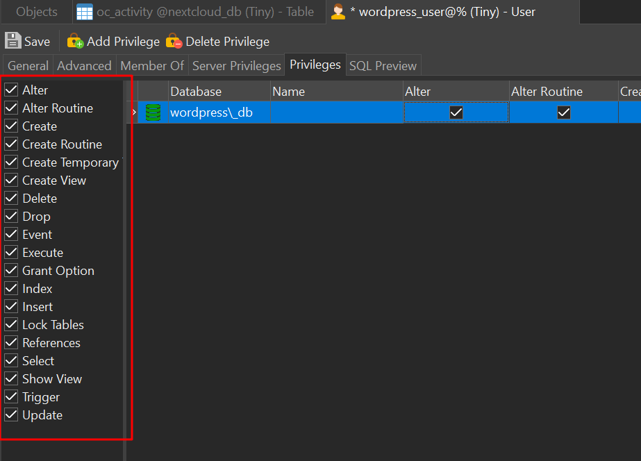

# WordPress 安装与配置（Docker版）

> WordPress是一款大名鼎鼎用来给小白搞建站的玩意，不用懂啥前端后台(当然懂肯定是最好的)，就像淘宝装修网店那样简单，有大量的免费好看的主题给你使用，总有一款适合你。用来展示静态网页，做个人博客之类的还是很合适。不过有不少人对这种建站方式不削一顾，大多数都是那些太过自负的前端程序员吧😀，毕竟抢了半个饭碗骂一骂还是可以理解，而且客观来讲确实wordpress能做的东西还是比较有限的。


## 安装之前

安装之前需要在mysql数据库里面新建一个用户、一个数据库，然后把数据库增删改查权限通通给用户，和nextcloud一毛一样，这里简单放几张截图，意思明白了就好，不明白的话就去看看Next cloud那张，之后我也会把这些MD文件全部发布在wordpress上，下面是navicat上的用户权限截图



当然也可以执行sql，代码如下，换汤不换药

```sql
CREATE DATABASE wordpress_db;           --创建数据库
CREATE USER wordpress_user@localhost identified by 'wordpresspasswd'; --创建用户
GRANT ALL PRIVILEGES ON wordpress_db.* TO wordpress_user@localhost IDENTIFIED BY 'wordpresspasswd';   --授予用户对数据库的权限
FULSH PRIVILEGES;   --刷新权限
EXIT;
```

完成之后就可以安装wordpress了

## WordPress Installation

直接上命令！

```shell
docker run 
-itd 
--name=wordpress 
--net=OscarsNet 						 #连接到自定义网络
-e WORDPRESS_DB_HOST=mariadb_main:3306   #数据库地址
-e WORDPRESS_DB_USER=wordpress_user      #数据库用户名
-e WORDPRESS_DB_PASSWORD=wordpresspasswd #数据库密码 
-e WORDPRESS_DB_NAME=wordpress_db 		 #数据库名称
-p 82:80  								 #端口映射
wordpress 
```


```shell
#复制区
docker run -itd --name=wordpress --net=OscarsNet -e WORDPRESS_DB_HOST=mariadb_main:3306 -e WORDPRESS_DB_USER=wordpress_user -e WORDPRESS_DB_PASSWORD=wordpresspasswd -e WORDPRESS_DB_NAME=wordpress_db -p 82:80  wordpress 
```


