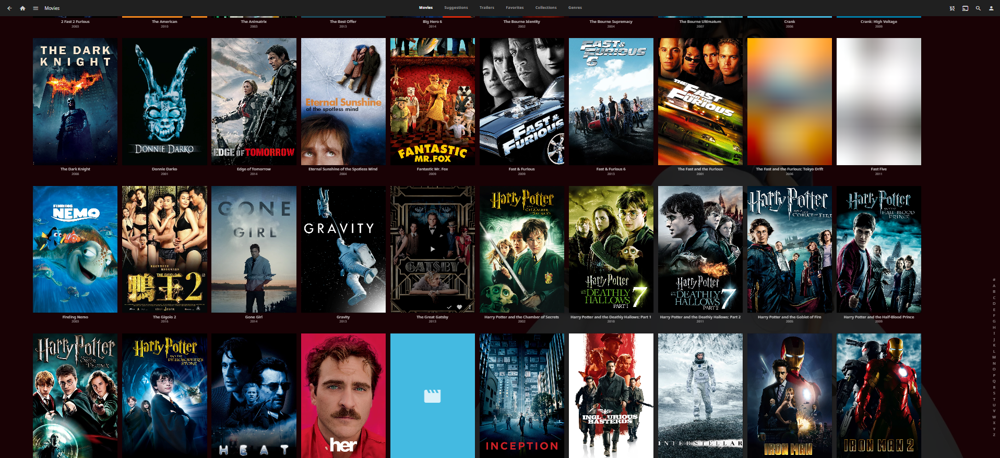
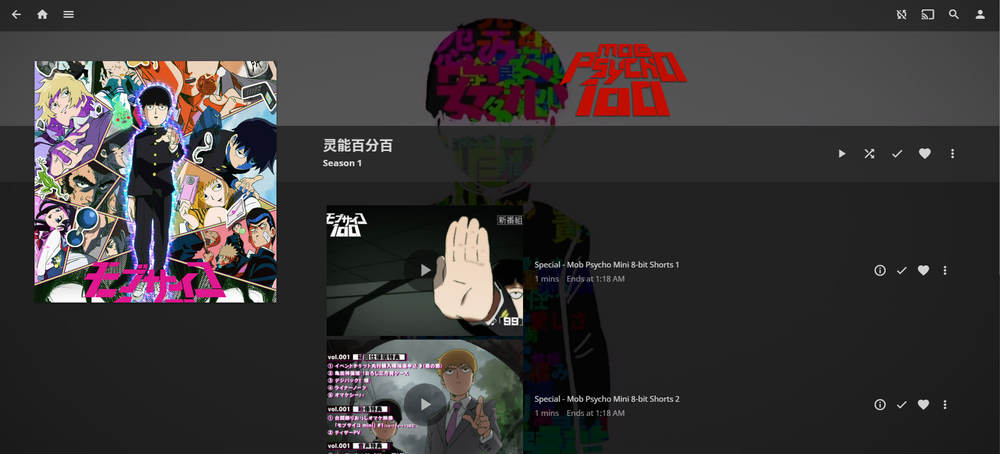
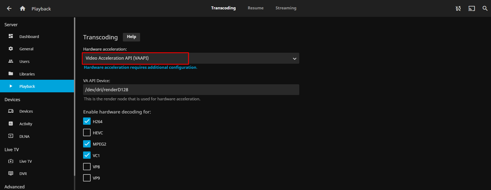

# 创建Dockers服务器群(Jellyfin 安装与配置)


> Jellyfin是一款开源免费的媒体资源管理软件，说白了就是播片用的，你的NAS上可能存了很多这样那样的“影视作品”，比如电影，电视剧，专辑，“学习资料”，等等，nextcloud虽然能够让你随时随地的访问它们，但是并不能像腾讯视频，网易云，pilipili等等这样的网站能够实时的推送给你，再加上国内分级制度大家都懂得，想看原汁原味，那就只有自己准备了，其实笔者折腾这个东西也是为了看一些国内看不到的东西，哎，最初最初的动机其实就是没钱。。。呜呜呜

## 开始前的废话

Jellyfin的前身是Emby你会发现两款软件操作逻辑，界面及其相似，唯一的区别就是Emby开启 **硬件转码** 需要付费，而jellyfin是免费开源的，想必大家知道为什么笔者要选择jellyfin了吧。这里提到一个硬件转码，那么什么是硬件转码呢？这就涉及到计算机处理视频方面的一些知识了

### 硬件解码

> 简单的来讲，计算机在处理电影的时候，因为每一帧（60hz来算两帧画面时间差距是0.017s）基本不会怎么变，甚至在对话场景下几乎没有任何区别，那么这样就可以使用一定的技巧来判断两张画面中变化的部分，然后在下次播放的时候还原出来，电脑就不用费力的储存所有的画面了，其实这个就是视频压缩技术。

一开始是cpu在处理这种解码的工作，这被称之为 **软件解码** 是利用处理器强大的通用计算能力完成计算（最典型的技术就是FFMPEG了，几乎支持所有视频格式），所以每当软解高清画质的视频时，cpu的占用会极大的提高，甚至一些低端的cpu会因为性能无法满足播放的速度而导致画面卡顿，这是非常影响观影体验的，后来人们看cpu太累了，就研发出了专用的解码、压缩的硬件，三家巨头都有自己的硬件解码器

| 厂家   | 对应技术   | 相关硬件支持链接                                          |
| ------ | ---------- | --------------------------------------------------------- |
| Intel  | Quick sync | https://en.wikipedia.org/wiki/Intel_Quick_Sync_Video      |
| Nvidia | NVENC      | https://en.wikipedia.org/wiki/Nvidia_NVENC                |
| AMD    | UVD、VCN   | https://en.wikipedia.org/wiki/Unified_Video_Decoder#VCN_1 |

这里以牙膏厂为例，如果你有使用过牙膏厂的带核心显卡的cpu，那么打开任务管理器，在GPU那一栏就可以看到当前视频解码器的工作状态


讲完硬件概念之后我们再来谈谈为什么jellyfin需要硬件解码。想象这么一个场景，你在下班回家的路途中想要看看昨天刚刚下载好的二刺螈女团8K歌舞番，这个视频只有20分钟，却有惊人的4个G，虽然你的手机性能足够完成8k视频的解码（假设）但是由于网络原因，网络带宽并不能满足你的这个需求，这个时候，如果jellyfin直接把4个G的视频推流给你的手机，由于带宽限制，你将看到的是断断续续的8k画面（虽然你的手机可能只有1080P），很显然，这是极大的浪费，所以在这种情景下硬件转码的优势就出来了，使用硬件转码之后jellyfin会把你的8k画面经过解码然后压制为1080p H264 规格的画面然后再推流给你的手机，这样你的手机得到的就是“恰到好处”的1080p画面，并且极大的节约了带宽。当然，**转码** 这种需求前面说过，也可以由软件+CPU来完成，但是缺点也很明显，你需要一台性能足够强大的CPU来应对同时解码、压缩的负载（这个负载可真不是闹着玩的）。

### 音影分类、整理

> 这里可能会将一个新词汇---- **刮削器**，简单的来说就是如果你有一个不知道哪去下载的一个高清生肉《死侍4》（就是没有字幕），然后就只有这么一个.mp4文件，没有简介没有演员介绍，没有片头，什么都没有。然后你把他放在jellyfin的影音文件夹下面，jellyfin完全可以扫描并播放、推送这个视频，但是确实不够美观。这个时候你可能会去想，能不能自己去网上找一点说明或是图片来修饰一下这个孤零零的文件。其实完全不用，因为这些工作都可以用刮削器来完成

刮削器其实就是一个媒体信息补全软件，使用了刮削器之后，你的媒体库会变得非常整洁，之后我会专门花一些篇幅来讲，在这里就不赘述了，直接开始安装环节

## Jellyfin installation

老规矩，直接上代码

```shell
docker run 
-itd 											#交互模式运行
--name=jellyfin  								#容器名称
--network=OscarsNet								#配置网络
-p 8096:8096 									#端口映射
-v /home/Data/:/home/Data  					    #卷映射，媒体库文件夹
-v /home/docker/jellyfin/appconfig:/config 		#卷映射，配置文件夹
--device /dev/dri/card0:/dev/dri/card0			#设备映射，把集显给docker
--device /dev/dri/renderD128:/dev/dri/renderD128
jellyfin/jellyfin								#镜像名称

```

一键复制区

```shell
docker run -itd --name=jellyfin --network=OscarsNet -p 8096:8096 -v /home/Data/:/home/Data -v /home/docker/jellyfin/appconfig:/config --device /dev/dri/card0:/dev/dri/card0 --device /dev/dri/renderD128:/dev/dri/renderD128 jellyfin/jellyfin					
```

安装之后直接访问8096端口，按照提示完成配置就可以了

之后放几张笔者实验用的临时环境



这个是电影墙，有很多奇奇怪怪的东西就不要在意了


简介页面，有电影的介绍，可以选择字幕，然后还有演员列表，甚至还有同演员的影片推荐，简直不要太贴心。



电视剧直接分季，然后每集都有简介，看看这界面难道你们不想要吗？


## 关于硬件转码

硬件转码需要在dashboard中配置



一般配置为VAAPI就可以了


## 中文字幕配置

这个没时间折腾了，一般的话手机上的app是支持的，电脑上用kodi