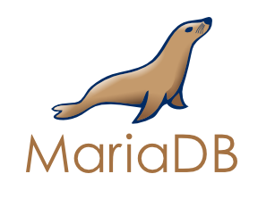
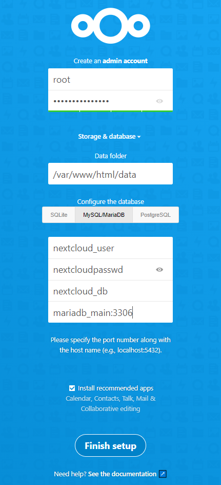

# 创建Dockers服务器群(Nextcloud+MariaDB篇)

> 这段时间闲得没事~~淦~~干，学了下Docker，发现tmd这玩意还是有点东西的，本着生命不息折腾不止的作死心态，像用docker实现一下跑在家里服务器上的各种服务(以前配置时还真费了不少时间)，家里的Server通过动态域名DDNS对外提供一些~~不痛不痒~~但是还比较好用的服务，如NAS、私人博客、影音服务器、~~小姐姐城堡~~、自建聊天服务器等等等等，分为以下几个部分,篇幅限制，那就先折腾一下Nextcloud+Mariadb的云储存吧，折腾这东西不比你博人传燃？
>
> 1. Mariadb Docker版的安装配置说明
> 2. Nextcloud 的安装与配置
> 3. 配置 LetsEncrypt 为不同节点 HTTPS 反向代理子域名
> 4. Jellyfin Docker 硬件直通和配置
> 5. RocketChat的安装和使用

## 1.Mariadb Installation



DockerHub上的   ： [MariaDB的官方说明](https://hub.docker.com/_/mariadb) 

> mariadb 是mysql被oracle收购之后fork出来的一个开源分支，为的是规避mysql被闭源的风险，两款软件如出一辙，具有非常好的兼容性。Ps：其实就是原班人马继续搞的，还是原来那味~

#### 安装之前的准备

首先需要在宿主机上安装dockerCE并将其运行起来，之后就可以开始安装我们的Mariadb安装了。

**BUT 但是 HOWEVER  ** 在这之前，还需要做一些准备工作 

* 确保之前没有安装过其他~~奇奇怪怪~~的镜像。

  ```shell
  #不知道怎么删除的话可以试试下面的命令
  docker rm -f $(docker ps -qa) #强制删除所有容器（包括运行中的）
  docker rmi -f $(docker images -qa) #删除所有本地镜像
  ```

* 我们需要为运行在Docker 中的服务提供一个本地的 **配置** 和 **数据** 存放的空间，方便之后映射，这样在容器生命周期结束，或者意外删除之后我们的配置文件和数据不至于丢失。

  ```shell
  #以下为笔者自建目录，感受一下，明白意思即可，大可不必都照着做
  
  [root@localhost ~]# cd /home
  [root@localhost ~]# mkdir -r /docker/mariadb/appdata
  [root@localhost ~]# mkdir -r /docker/mariadb/appconfig
  
  # 其中 
  # /appdata 用于存储文件数据 
  # /appconfig 用于存储各种服务的配置
  
  ```

* 因为宿主机还需要添加很多 **互相之间需要网络连接** 的服务应用，所以需要自建一个网络，方便之后容器之间的互联。

  ```shell
  #首先查询一下网络，发现有三个默认网络
  [root@localhost ~]# docker network ls
  NETWORK ID     NAME      DRIVER    SCOPE
  4be2cd3bc0b2   bridge    bridge    local
  12049f97842f   host      host      local
  1a8822b17eaa   none      null      local
  
  #创建自建网络
  [root@localhost home]# docker network create --driver bridge --subnet 172.172.0.0/16 --gateway 172.172.0.1 OscarsNet
  ea6067d3c39e0cd0981dccd0a9dfc41e094024a57431c57ecaf677a8f89a39f9
  
  # 参数解释
  # driver  ：  设备类型   这里选择的是bridge 桥接类型
  # subnet  ：  子网      这里相当于是dhcp的地址范围
  # gateway :   网关      这里相当于家里上网的路由器
  # OscarNet：  自定义网络名称
  
  ```

  之后继续运行

  ```shell
  docker network ls
  ```

  自建网络就会出现在上面 **图上红框部分**，这就表示网络成功生成了

  

  之后只要是在此网络之内的 **所有** 主机，通过对方的 **容器名称** 都可以Ping到对方

  原理可以理解为自动的把主机名称添加到了各个容器的host文件中。

#### 开始安装MariaDB

安装也只需要一句话就可以了

```shell
docker run -itd 
		   --name=mariadb_main  							    #容器名称
		   --network=OscarsNet  							    #连接到自定义网络
		   -e MYSQL_ROOT_PASSWORD=123456790					    #你的ROOT密码
		   -v /home/docker/mariadb_main/appconfig:/etc/mysql    #配置文件
		   -v /home/docker/mariadb_main/appdata:/var/lib/mysql  #数据文件
		   -p 3336:3306							 #暴露内部3306端口到外部，提供远程连接
		   mariadb 						#镜像名称，如需下载特定版本在后面加‘:’然后输入TAG即可


#    参数解释
#    -itd        				 以交互模式运行
#    --name       				 为容器起一个名字（上面的例子中就叫main）
#	 --network				     连接到自定义网络
#    -e MYSQL_ROOT_PASSWORD		 mariaDB重要参数，root用户密码
#    -v							 挂载本地文件夹
#    -p 3336:3306                把宿主机3336映射到内部3306端口

```

```shell
# 一键脚本复制区

#!/bin/bash

#read from user input
read -p 'Please enter your root password for MariaDB:' password
read -p 'Enter the port number you want 3306 to expose to:' port_num

#create dockers
echo 'Creating test dockers'

docker run -itd --name=mariadb_main --network=OscarsNet -e MYSQL_ROOT_PASSWORD=$password -v /home/docker/mariadb_main/appconfig:/etc/mysql -v /home/docker/mariadb_main/appdata:/var/lib/mysql -p $port_num:3306 mariadb

docker run -d --name=mariadb_test -e MYSQL_ROOT_PASSWORD=$password mariadb

#copy data
docker cp mariadb_test:/etc/mysql /home/docker/mariadb_main/appconfig

#clean
echo 'cleaning'
docker rm -f mariadb_test
cd /home/docker/mariadb_main/appconfig/mysql
mv ./* ../ 
rm -rf /home/docker/mariadb_main/appconfig/mysql

```

#### 安装成功

进去Navicat或者其他数据库远程工具查看


填入信息，注意Port口需要填写宿主机暴露的端口，本例中是 **(Docker)3306  >>>EXPOSE>>> 3336 (HOST)**

填写账户密码之后然后连接进去，随便选一个database，ok！成功！


## 2.Nextcloud Installtion


DockerHub 上的链接 : [NextCloud官方说明](https://hub.docker.com/_/nextcloud)

> A safe home for all your data. Access & share your files, calendars, contacts, mail & more from any device, on your terms.
>
> 翻译成人话就是：你的~~小姐姐~~数据的家，随时随地用任何设备都可以访问分享你的数据
>
> 这个项目的前身是owncloud，估计用过的一眼就看出来了，也是当时开发组不满owncloud的闭源，一部分人离职直接搞了个新的出来，好家伙直接起名叫 ‘NEXT’ 下一代云，牛皮牛皮！下面我们就来看看吧这个牛逼装进容器里会发生什么化学反应。

#### 安装之前的准备

* 确保自己有足够的空间来存放文件，最好是使用 **网络挂载** 局域网NAS的SMB或者nfs路径（笔者的NAS暂时用的 [OMV](https://www.openmediavault.org/)，并且数据和前台服务分离--就是有两台物理机，这可以增加系统的 安全性 和 灵活性）。
* 上面我们不是已经安装了MariaDB并且已经配置好并启动了容器，现在我们要在MariaDB上创建为nextcloud专门创建一个用户和数据库，并开放权限，之后的初始化建表的工作，Nextcloud就会自动帮我们完成啦 ~ 下面提供两种方法新建用户并赋予权限
  * **Navicat直接GUI上操作**
    
    1. 连接上服务器之后点击 User(用户)按钮
    
    2. 点击添加用户
    
    3. 按照规则填写相关信息，保存之后就可以在Objects标签下看到你所创建得用户了
    
       
    
    4. 之后需要创建一个供Nextcloud使用得数据库，在连接上右键，点击新建数据库填写相关信息即可
    
       
    
    5. 下面要把nextcloud_db得权限全部付给nextcloud_user，让其全权管理
    
    6. 新开一个查询窗口
    
       
    
    7. 把这段话复制到窗口中直接执行
    
       ```sql
       GRANT ALL PRIVILEGES ON nextcloud_db.* TO nextcloud_user@localhost IDENTIFIED BY 'nextcloudpasswd';
       FLUSH PRIVILEGES;
       ```
    
       
    
    8. 运行成功
    
       

  * **shell中手动操作**

    1. 首先我们直接进入容器shell

    ```shell
    [root@localhost ~]# docker exec -it mariadb_main bash
    root@7e1c3a11843b:/#
    ```

    2. 输入 mysql -p 并输入密码，进入数据库

    ```shell
    root@7e1c3a11843b:/# mysql -p
    Enter password:
    Welcome to the MariaDB monitor.  Commands end with ; or \g.
    Your MariaDB connection id is 9
    Server version: 10.5.8-MariaDB-1:10.5.8+maria~focal mariadb.org binary distribution
    
    Copyright (c) 2000, 2018, Oracle, MariaDB Corporation Ab and others.
    
    Type 'help;' or '\h' for help. Type '\c' to clear the current input statement.
    
    MariaDB [(none)]>
    
    ```

    3. 输入以下SQL 完成创建数据库

    ```sql
    CREATE DATABASE nextcloud_db;           --创建数据库
    CREATE USER nextcloud_user@localhost identified by 'nextcloudpasswd'; --创建用户
    GRANT ALL PRIVILEGES ON nextcloud_db.* TO nextcloud_user@localhost IDENTIFIED BY 'nextcloudpasswd';   --授予用户对数据库的权限
    FULSH PRIVILEGES;   --刷新权限
    EXIT;
    ```
  ```
  
  ```
  
* 都21世纪了怎么能少了自动化脚本 ？将此脚本复制到docker宿主机上运行即可
  
    ```shell
    #运维快乐jio本复制粘贴区
    #脚本未经测试，要是拉垮本人不负任何责任
    
    #!/bin/bash
    
    #database username and passwrod
    MYSQL_USER_NAME='root'            #自行修改即可
    MYSQL_PASSWORD='123456'  		  #自行修改即可
    
    docker exec -it mariadb_main mysql -u$MYSQL_UER_NAME -p$MYSQL_PASSWORD -e "CREATE DATABASE nextcloud_db;CREAT USER nextcloud_user@localhost identified by \'nextcloudpasswd\';GRANT ALL PRIVILEGES ON nextcloud_db.* TO nextcloud_user@localhost IDENTIFIED BY \'nextcloudpasswd\';EXIT;"
    
    # 参数解释
    # -u   ： 后面**无空格**跟数据库用户名
    # -p   ： 后面**无空格**跟数据库密码
    # -e   ： 需要执行得SQL
    
    echo "Created"
    echo "DataBase   : nextcloud_db"
    echo "User       : nextcloud_user"
    echo "Password   : nextcloudpasswd"
    ```

#### 开始安装Nextcloud

> 终于到了刺激的~~删库~~安装环节啦，下班码码字再走发现已经块10点了，继续继续。。

安装无非就是从仓库里面拉取镜像之后直接使用就可以了，稍微注意下-v参数的路径就好

```shell
docker run -itd 										#以交互模式运行
           --name=nextcloud_main 						  #容器名称
           --network=OscarsNet  						  #连接到网络（会自动帮你配置host）
           -v /home/docker/nextcloud/appconfig:/var/www/html #挂载 配置 目录到本地
           -v /home/NextCloud/:/var/www/html/data 			 #挂载 数据 目录到本地
           -p 81:80 								      #暴露81端口
           nextcloud									 #镜像名称
          
#参数解释
#其他都跟上面mariadb的一样
# -p   :  开放宿主机的81端口并转发到容器的80端口，nextcloud主要是靠网页提供服务，默认端口是80
```

```shell
# 一键脚本复制区
docker run -itd --name=nextcloud_main --network=OscarsNet -v /home/docker/nextcloud/appconfig:/var/www/html -v /data/NextCloud:/var/www/html/data -p 81:80 nextcloud
```


等待显示容器id之后就表示安装完成了，用命令查看一下

```shell
CONTAINER ID   IMAGE       COMMAND                  CREATED          STATUS          PORTS                    NAMES
d70ce9e94f5a   nextcloud   "/entrypoint.sh apac…"   19 minutes ago   Up 19 minutes   0.0.0.0:81->80/tcp       nextcloud_main
900319f52789   mariadb     "docker-entrypoint.s…"   48 minutes ago   Up 48 minutes   0.0.0.0:3336->3306/tcp   mariadb_main
```

可以看到之前的mariadb和nextcloud都在运行

#### 完成相关配置

* 安装好之后直接通过宿主机ip:81端口进入Nextcloud配置界面

  

  根据刚刚的数据库信息填写正确的信息，之后点击“Finish setup”完成安装

#### 安装成功


进到这个界面就表示安装成功啦~Nice！

#### 常见问题

* 点击按钮之后有很多坑随便列几个比较常见的，给一下解决方案

  1. 直接打不开网页

     这个时候就要康康你的防火墙配置了啊

     ```shell
     #centos 7 及以上版本都是使用firewall-cmd命令来更改防火墙配置啦，iptabales在这里就不赘述了
     #原理就是把宿主机的81端口暴露出去
     firewall-cmd --zone=public --add-port=81/tcp --permanent #开放81端口
     firewall-cmd --reload            						 #重载防火墙规则
     firewall-cmd --list-all									 #之后查看一下
     ```

     出现以下信息说明已经成功添加规则

     ```shell
     [root@localhost data]# firewall-cmd --list-all
     public (active)
       target: default
       icmp-block-inversion: no
       interfaces: eno1
       sources:
       services: dhcpv6-client ssh
       ports: 81/tcp 8089/tcp 3366/tcp         #这里可以看到81端口已经是对外开放的了
       protocols:
       masquerade: no
       forward-ports:
       source-ports:
       icmp-blocks:
       rich rules:
     
     ```

     

  2. 权限问题

     

     无法创建或写入 data路径

     进到docker 里面去chown -R 一下

     ```shell
     docker -exec -it nextcloud_main bash       #在宿主机输入命令进入容器内部
     cd /var/www/html                           #一般默认的工作目录就会在这个目录下
     chown -R www-data:root ./*                 #把html文件夹下的所有文件的权限改掉
     #若数据文件较多可能会花费不少时间去修改权限
     
     # 参数解释
     # -R              ：    递归修改，包括子文件夹 
     ```

  3. 截图弄掉了就不演示了，大概意思就是数据库连接不上或者拒绝连接

     遇到这种情况一般就是mairadb那边的用户没有允许远程登录，这里用navicat检查一下

     

     连进数据库看一看Host是不是%，%的意思就是所有的ip都可以用（192.168.1.%就是只允许192.168.1.0/24网段的计算机进行连接）出现上诉问题的话这里有可能是localhost也就是只允许本地登录。

     如果配置没问题，那就重启一下nextcloud容器和maria的容器了，毕竟重启解决50%问题这个名句砸门还是要信一信。

  4. 之后遇到什么问题会在这里继续更新

  ----------------------------------------------------

  2021-02-21    --by oscar

