# Mybatis项目建立

这几天学习一下Idea的Mybatis项目配置，顺便写个demo，人老了记忆力不好，写个笔记吧，先看看项目配置前提：

1. 安装了jdk并正确配置环境变量
2. 安装了maven并正确配置了环境变量


### 新建IdeaMaven项目

1. 首先需要新建一个idea的maven项目

* 在已有项目的基础上新建一个模块即可

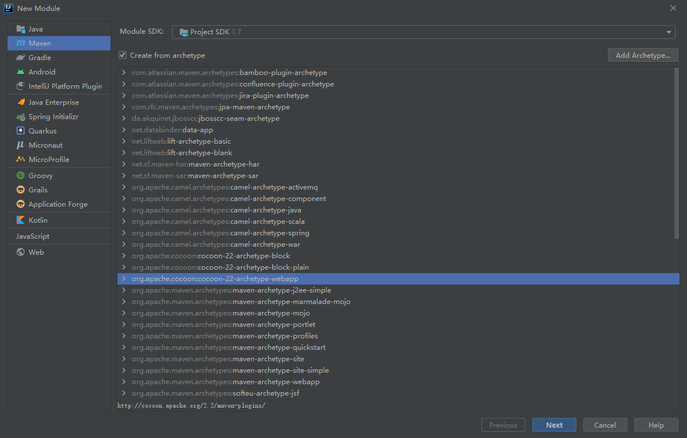

2. 然后再项目上右击新建目录

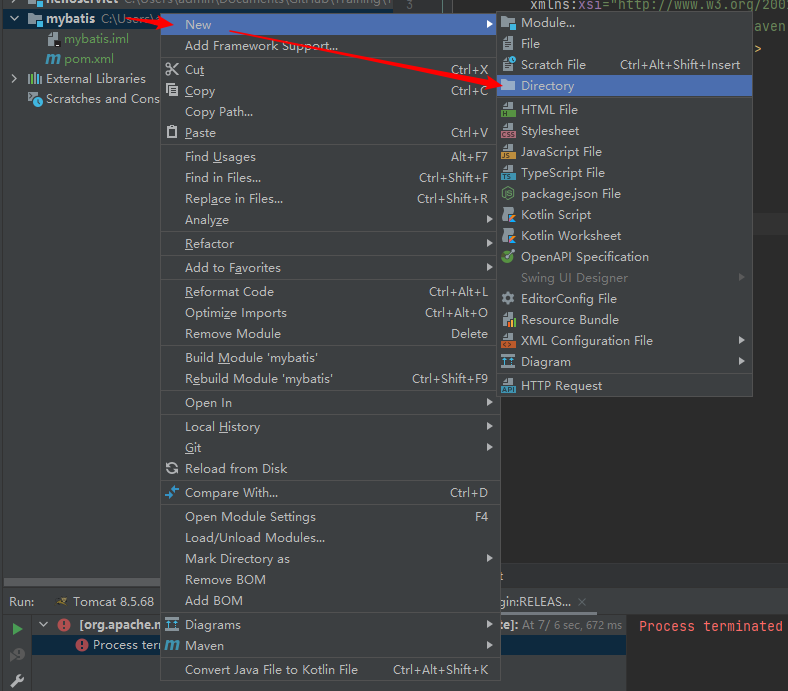

3. 选择java，resouce和test就可以了

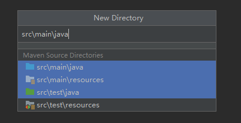

4. 完成之后目录结构如图所示

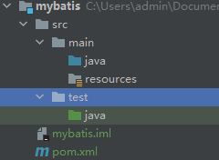

### 在pom文件中添加mybatis依赖

要使用 MyBatis， 只需将 [mybatis-x.x.x.jar](https://github.com/mybatis/mybatis-3/releases) 文件置于类路径（classpath）中即可。

如果使用 Maven 来构建项目，则需将下面的依赖代码置于 pom.xml 文件中：

本例添加了 mysql的依赖和 mybatis的依赖 具体可以去maven网站上查询

```xml
<dependencies>
        <!-- https://mvnrepository.com/artifact/org.mybatis/mybatis -->
        <dependency>
            <groupId>org.mybatis</groupId>
            <artifactId>mybatis</artifactId>
            <version>3.4.6</version>
        </dependency>
        <!-- https://mvnrepository.com/artifact/mysql/mysql-connector-java -->
        <dependency>
            <groupId>mysql</groupId>
            <artifactId>mysql-connector-java</artifactId>
            <version>8.0.21</version>
        </dependency>

    </dependencies>
```

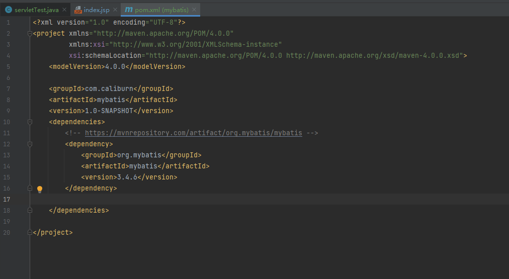

添加之后等待一下，或者点击idea右侧maven设置手动下载一下依赖

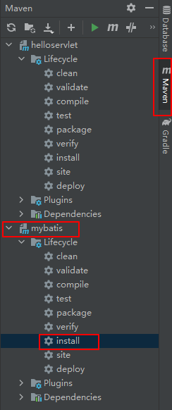

完事之后pom文件不报红就行了

### 在数据库中建立相应数据库和表（如果有现成的可以跳过）

1. 在idea中创建相关链接

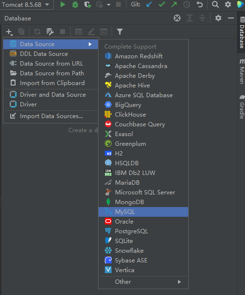

我的测试数据库在本地，链接方法如下图所示

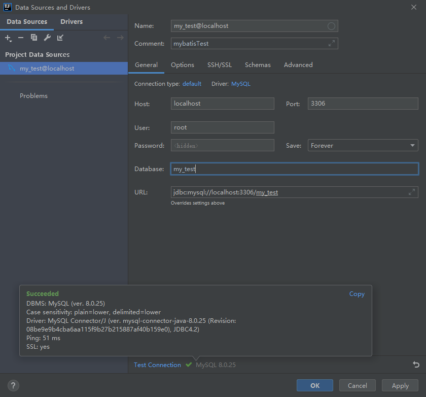

2. 创建demo表，语句如下

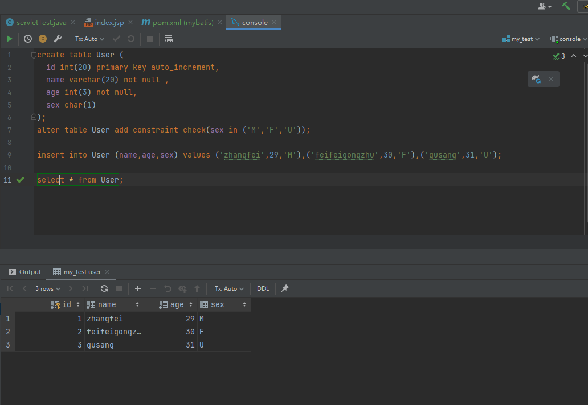

创建对应表，sql语句如下

```sql
create table User (
  id int(20) primary key auto_increment,
  name varchar(20) not null ,
  age int(3) not null,
  sex char(1)
);
alter table User add constraint check(sex in ('M','F','U'));

insert into User (name,age,sex) values ('zhangfei',29,'M'),('feifeigongzhu',30,'F'),('gusang',31,'U');

select * from User;
```

### 创建数据库连接配置文件

填写一个配置文件，调整参数，让mybatis方便的获取到连接对象

1. 在resource文件夹下创建一个配置xml文件（以下xml需要根据情况改动）

```xml
<?xml version="1.0" encoding="UTF-8" ?>
<!DOCTYPE configuration
  PUBLIC "-//mybatis.org//DTD Config 3.0//EN"
  "http://mybatis.org/dtd/mybatis-3-config.dtd">
<configuration>
  <environments default="development">
    <environment id="development">
      <transactionManager type="JDBC"/>
      <dataSource type="POOLED">
        <property name="driver" value="com.mysql.jdbc.Driver"/>
        <property name="url" value="jdbc:mysql://localhost:3306/my_test"/>
        <property name="username" value="root"/>
        <property name="password" value="12345"/>
      </dataSource>
    </environment>
  </environments>
  <mappers>
    <mapper resource="org/mybatis/example/BlogMapper.xml"/>
  </mappers>
</configuration>
```


* 提示1

```xml
<property name="driver" value="com.mysql.jdbc.Driver"/>
```

这里需要前面的maven添加mysql的依赖，不然会找不到找个包，idea输入的时候有提示就是正确的

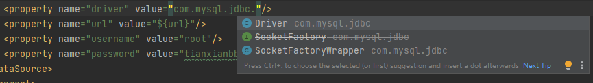

* 提示2

```xml
<property name="url" value="jdbc:mysql://localhost:3306/my_test"/>
```

数据库连接URL可以通过idea获取

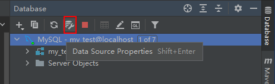

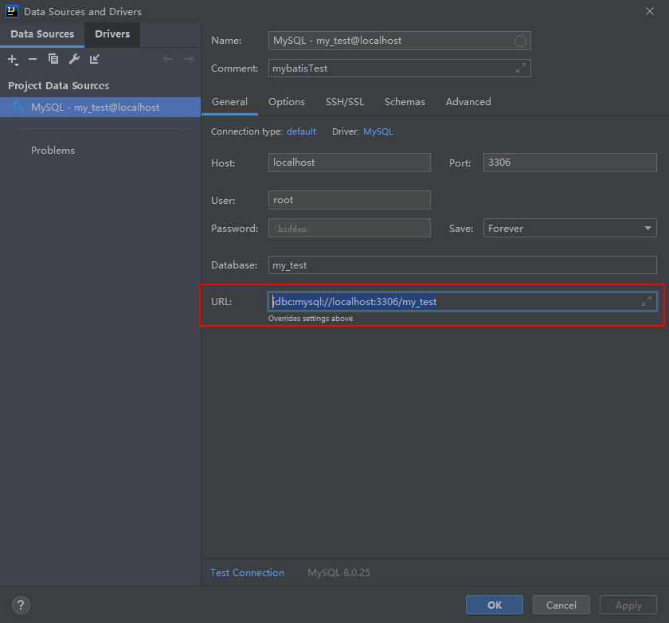

* 提示3

```xml
<mappers>
    <mapper resource="org/mybatis/example/BlogMapper.xml"/>
  </mappers>
```

Mapper之后会，先放在这里不管他

### 新建一个包，实现MybatisUtils工具类

这一步的用意是 将 mybatis 获取sqlsession对象的过程封装成一个工具类方便之后调用

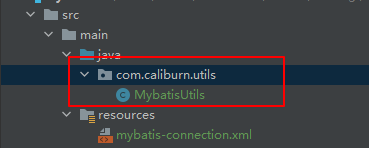

该类代码如下，静态代码块中实现了通过xml文件获取到一个factory对象，可以直接打开sqlsession

```java
package com.caliburn.utils;

import org.apache.ibatis.io.Resources;
import org.apache.ibatis.session.SqlSession;
import org.apache.ibatis.session.SqlSessionFactory;
import org.apache.ibatis.session.SqlSessionFactoryBuilder;

import java.io.IOException;
import java.io.InputStream;

public class MybatisUtils {
    
    private static SqlSessionFactory sqlSessionFactory = null;

    static {
        String resource = "com/cmybatis-config.xml"; //这里填写你的配置文件目录
        InputStream inputStream = null;
        try {
            inputStream = Resources.getResourceAsStream(resource);
            sqlSessionFactory = new SqlSessionFactoryBuilder().build(inputStream);
        } catch (IOException e) {
            e.printStackTrace();
        }
    }
    //调用该方法可以直接得到一个sqlsession
    public static SqlSession getSession(){
        if(sqlSessionFactory!=null){
            return sqlSessionFactory.openSession();
        }
        return null;
    }
}

```

### 配置工作完成之后，写一个实体类

首先需要创建一个和数据库中对应的类对象，新建一个pojo包，然后创建一个User类

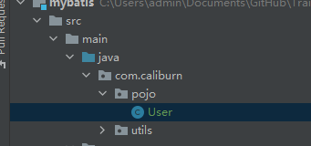

然后利用 alt+insert 快捷键实现快速的 代码补全实现 getter 和 setter，一个空参构造和一个全参构造，还可以顺便加一个toString方法

最终代码如下

```java
package com.caliburn.pojo;

public class User {
    private int id;
    private String name;
    private int age;
    private String sex;

    public User() {
    }

    public User(int id, String name, int age, String sex) {
        this.id = id;
        this.name = name;
        this.age = age;
        this.sex = sex;
    }

    public int getId() {
        return id;
    }

    public void setId(int id) {
        this.id = id;
    }

    public String getName() {
        return name;
    }

    public void setName(String name) {
        this.name = name;
    }

    public int getAge() {
        return age;
    }

    public void setAge(int age) {
        this.age = age;
    }

    public String getSex() {
        return sex;
    }

    public void setSex(String sex) {
        this.sex = sex;
    }

    @Override
    public String toString() {
        return "User{" +
                "id=" + id +
                ", name='" + name + '\'' +
                ", age=" + age +
                ", sex='" + sex + '\'' +
                '}';
    }
}

```

### 然后是实现一个dao（持久层）的代码

新建一个接口，里面封装一些对User对象的操作，代码如下

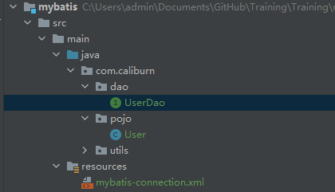

```java
package com.caliburn.dao;
import com.caliburn.pojo.User;
import java.util.List;

public interface UserDao {
    List<User> getAllUser();
}

```

可以看到里面 有一个**getAllUser();** 方法，该方法是用来获取所有用户，然后返回一个User对象组成的List，对应的sql就是

```sql
select * from User;
```

如何让数据库执行sql或者说是如何让这个操作和数据库sql发生关系呢？

mybatis提供了一个配置文件

### 编写sql配置文件，和接口联系在一起

1. 在刚刚接口文件的路径下，新建一个配置文件 名字叫UserMapper.xml

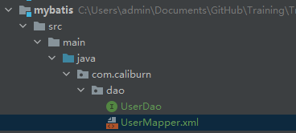

2. 内容如下，需要主义的已经写在注释中了

```xml
<?xml version="1.0" encoding="UTF-8" ?>
<!DOCTYPE mapper
        PUBLIC "-//mybatis.org//DTD Mapper 3.0//EN"
        "http://mybatis.org/dtd/mybatis-3-mapper.dtd">
<!--Mapper需要绑定刚刚的接口-->
<mapper namespace="com.caliburn.dao.UserDao">
    <!--select标签中id需要套填写对应的方法名称-->
    <!--resultType中需要填写对应返回的实体对象-->
    <select id="getAllUser" resultType="com.caliburn.pojo.User">
        select * from my_test.User;
    </select>
</mapper>
```

### 之后就可以测试下了

在test下建立项目对应的包，新建一个类名字叫UserDaoTest用于测试

项目结构如下

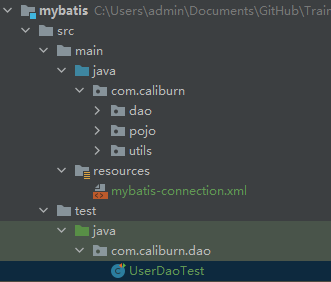

写一下测试代码

```java
package com.caliburn.dao;

import com.caliburn.pojo.User;
import com.caliburn.utils.MybatisUtils;
import org.apache.ibatis.session.SqlSession;
import org.junit.Test;

import java.util.List;

public class UserDaoTest {
    @Test
    public void test(){
        SqlSession sqlSession = MybatisUtils.getSession();   //通过工具类获取sql连接对象
        UserDao mapper = sqlSession.getMapper(UserDao.class);//通过接口获取对象
        List<User> allUser = mapper.getAllUser();            //获取过后可以直接调用mapper中的方法
        for (User user : allUser) {
            System.out.println(user.toString());
        }
    }
}
```

