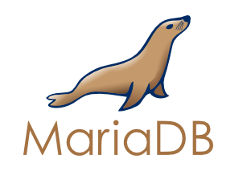
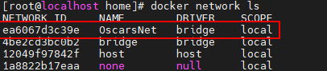

# 创建Dockers服务器群

> 该教程用于创建Oscar的私有节点，通过域名对外提供少量服务，分为以下几个部分
>
> 1. Mariadb Docker版的安装配置说明
> 2. Nextcloud 的安装与配置
> 3. 配置 LetsEncrypt 为不同节点 HTTPS 反向代理子域名
> 4. Jellyfin Docker 硬件直通和配置
> 5. RocketChat的安装和使用

## 1.Mariadb Installation



DockerHub上的   ： [MariaDB的官方说明](https://hub.docker.com/_/mariadb) 

> mariadb 是mysql被oracle收购时候fork出来的一个开源分支，为的是规避mysql被闭源的风险，两款软件操作上如出一辙，而且具有非常好的兼容性。

#### 安装之前的准备

首先需要在宿主机上安装dockerCE并将其运行起来，之后就可以开始安装我们的Mariadb了。

但是在这之前，还需要做一些准备工作

* 我们需要为运行在Docker 中的服务提供一个本地的 **配置** 和 **数据** 存放的空间，方便之后映射，这样在容器生命周期结束，或者意外删除之后我们的配置文件和数据不至于丢失

  ```shell
  #以下为笔者自建目录，感受一下，明白意思即可，大可不必都照着做
  
  [root@localhost ~]# cd /home
  [root@localhost ~]# mkdir -r /docker/appdata
  [root@localhost ~]# mkdir -r /docker/appconfig
  
  # 其中 
  # /appdata 用于存储文件数据 
  # /appconfig 用于存储各种服务的配置
  
  ```

  

* 因为宿主机还需要添加很多 **互相之间需要网络连接** 的应用，所以我们需要自建

  ```shell
  #首先查询一下网络，发现有三个默认网络
  [root@localhost ~]# docker network ls
  NETWORK ID     NAME      DRIVER    SCOPE
  4be2cd3bc0b2   bridge    bridge    local
  12049f97842f   host      host      local
  1a8822b17eaa   none      null      local
  
  #创建自建网络
  [root@localhost home]# docker network create --driver bridge --subnet 172.172.0.0/16 --gateway 172.172.0.1 OscarsNet
  ea6067d3c39e0cd0981dccd0a9dfc41e094024a57431c57ecaf677a8f89a39f9
  
  # 参数解释
  # driver  ：  设备类型   这里选择的是bridge 桥接类型
  # subnet  ：  子网      这里相当于是dhcp的地址范围
  # gateway :   网关      这里相当于家里上网的路由器
  # OscarNet：  自定义网络名称
  
  
  ```

  之后继续运行

  ```shell
  docker network ls
  ```

  自建网络就会出现在上面 **图上红框部分**

  

  之后只要是在此网络之内的 **所有** 主机，通过对方的 **容器名称** 都可以Ping到对方

  原理有点像自动的把主机名称添加到了各个容器的host文件中

#### 开始安装MariaDB

安装也只需要一句话就可以了

```shell
docker run -itd --name=mymariadb  

#参数说明
#    -itd         以交互模式运行
#    --name       为容器起一个名字（上面的例子重就叫）
#    
```

